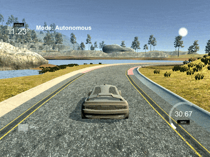
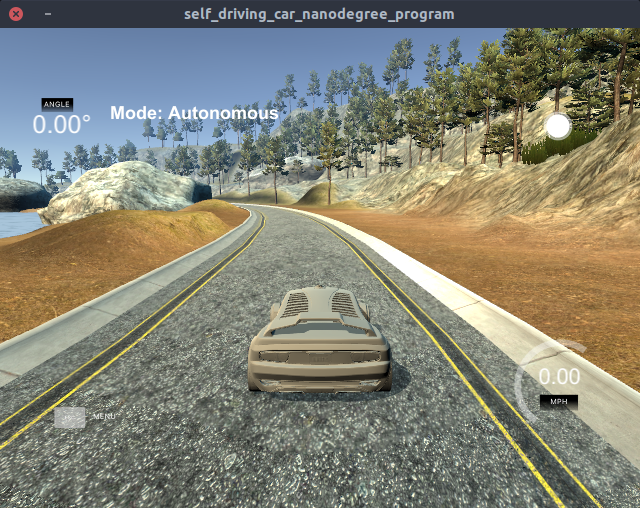

# PID Control
[](LICENSE) [](https://www.codacy.com/manual/frgfm/sdcnd-pid-control?utm_source=github.com&amp;utm_medium=referral&amp;utm_content=frgfm/sdcnd-pid-control&amp;utm_campaign=Badge_Grade)  

PID Control project of Udacity Self-Driving Car Nanodegree (cf. [repo](https://github.com/udacity/CarND-PID-Control)).




## Table of Contents

- [Getting Started](#getting-started)
  - [Prerequisites](#prerequisites)
  - [Installation](#installation)
- [Usage](#usage)
- [Approach](#Approach)
- [Credits](#credits)
- [License](#license)


## Getting started

### Prerequisites

- [Unity3D](https://unity3d.com/get-unity/download): 3D game engine used for our simulation.
- make (>= 4.1 on Linux, Mac, >= 3.81 on Windows): the buildsystem of the project.
  - Linux: make is installed by default on most Linux distros
  - Mac: [install Xcode command line tools to get make](https://developer.apple.com/xcode/features/)
  - Windows: [Click here for installation instructions](http://gnuwin32.sourceforge.net/packages/make.htm)
- [cmake](https://cmake.org/install/) 3.5 (or newer): buildsystem generator.
  - Any OS: [click here for installation instructions](https://cmake.org/install/)
- [gcc](https://gcc.gnu.org/)/g++ 5.4 (or newer): to compile the C++ code.
  - Linux: gcc / g++ is installed by default on most Linux distros
  - Mac: same deal as make - [install Xcode command line tools](https://developer.apple.com/xcode/features/)
  - Windows: recommend using [MinGW](http://www.mingw.org/)
- [uWebSockets 0.13.0](https://github.com/uNetworking/uWebSockets/archive/v0.13.0.tar.gz): to handle our web-server.
  - Linux/Mac: [click here for installation instructions](https://github.com/uWebSockets/uWebSockets)
  - Windows: use either Docker, VMware, or even [Windows 10 Bash on Ubuntu](https://www.howtogeek.com/249966/how-to-install-and-use-the-linux-bash-shell-on-windows-10/) to install uWebSocketIO
- [json](https://github.com/nlohmann/json): to interact with JSON files *(header-only)*.
  - Any OS: place the [file](https://github.com/nlohmann/json/releases/download/v3.7.3/json.hpp) in the  `include/` folder
- [Catch](https://github.com/catchorg/Catch2): for unittests *(header-only)*
  - Any OS: place the [file](https://github.com/catchorg/Catch2/releases/download/v2.11.3/catch.hpp) in the `lib/` folder
- [spdlog](https://github.com/gabime/spdlog): for console logging *(header-only)*
  - Any OS: extract the [archive](https://github.com/gabime/spdlog/archive/v1.5.0.tar.gz) and place the `include/spdlog` directory in the  `include/` folder

*Note: If you are running a Unix system, the installation scripts in the folder `scripts/` will install all the requirements apart from Unity3D. From the repository's main directory, run `bash scripts/install-linux.sh` for Linux or run `bash scripts/install-mac.sh` for MacOS to install those dependencies.*

### Installation

#### C++

Your folder hierarchy should look like below:

```
.
├── CMakeLists.txt
├── include
│   ├── json.hpp
│   └── spdlog
├── lib
│   └── catch.hpp
├── LICENSE
├── README.md
├── scripts
│   ├── format-project.sh
│   ├── install-cppdeps.sh
│   ├── install-linux.sh
│   └── install-mac.sh
├── src
│   ├── helpers.cpp
│   ├── helpers.h
│   ├── main.cpp
│   ├── PID.cpp
│   └── PID.h
├── static
│   └── images
└── test
    ├── helpers_test.cpp
    └── main_test.cpp
```

Now you can build the project:

```bash
mkdir build && cd build
cmake .. && make && cd ..
```


#### Unity

After installing Unity3D, you will need an environment build to run the simulation. Download the appropriate build for your OS and extract it:

- [Linux](https://github.com/udacity/self-driving-car-sim/releases/download/v1.45/term2_sim_linux.zip)
- [Mac](https://github.com/udacity/self-driving-car-sim/releases/download/v1.45/term2_sim_mac.zip)
- [Windows](https://github.com/udacity/self-driving-car-sim/releases/download/v1.45/term2_sim_windows.zip)

If you encounter an issue with the above builds, please refer to the "Available Game Builds" section of this [readme](https://github.com/udacity/self-driving-car-sim).


## Usage

### Unittests

By compiling the project previously, you created 2 executables. One of them is here to run unittests using [Catch2](https://github.com/catchorg/Catch2). In order to run the tests, use the following command:

```bash
build/tests
```

which should yield something similar to:

```shell
===============================================================================
All tests passed (4 assertions in 2 test cases)
```


### Project build

Run the recently built project using the following command:

```
build/pid
```

The compiled program is now listening to events on port `4567` using a web server. We just need to run our Unity3D environment to see the results.

- Run the `term2_sim` executable after extracting the environment archive *(you might have to make it executable on Unix systems)*.
- Select the Resolution and Graphics settings for your setup.
- Click on `Next` until you reach `Project 4: PID Controller`
- Click on `SELECT`


## Approach

This project involves an agent (vehicle on a highway) exposed to continuous state and action spaces. The environment is not interactive for the user, the only accepted input is the predicted steering angle of the vehicle.

### Environment

This Unity environment offers a car driving experience on a single track. 



The autonomous mode lets the developer plug a C++ program through a web server that handles the car controls.

Please refer to this [repository](https://github.com/udacity/self-driving-car-sim) for further details.


### Implementing a PID controller

We follow the description of a PID control unit


Here we consider mainly the cross-track error (CTE) for our controller. The PID controller works as follows:

- the `Kp` coefficient scales the steering proportional to CTE. If this is only a P-controller, we would get strong oscillations.
- the `Kd` coefficient adds a component scaling with the variations of CTE, which smooths the proportional correction. If this is only a PD controller, our system would easily be disturbed by imperfect control.
- the `Ki` coefficient adds the last component that scales with the primitive of CTE (sum of CTE values for discrete signals), which normalizes our error in regards to control noise.


In the `src` folder, you will find:

- `main`: reads measurement data from Unity3D and runs the PID controller.
- `PID`: handles the PID error computation.
- `Monitor`: handles performance evaluation.
- `helpers`: unit conversion and data reading.

After a few manual iterations, by tweaking the coefficients to reduce oscillations, the following values were selected:

- `Kp = 0.15`
- `Ki = 0.004`
- `Kd = 3.0`


### Results

The previously mentioned implementation yields an acceptable driving behaviour in regards to lane keeping as shown below.


The implementation is evaluated using two metrics: the CTE to make sure the vehicle stays on target, and the mean angular acceleration that reflects the passenger comfort.

| avg CTE   | avg angular acceleration |
| --------- | ------------------------ |
| 0.5777326 | 0.11831327               |


The full-length lap recording in third-person view is available for download in the release attachments:

- [Full lap recording](https://github.com/frgfm/sdcnd-pid-control/releases/download/v0.1.0/lap_recording.mp4)


## Limitations and improvements

Currently, the implementation feels a bit shaky and could be improved further. Here are a few leads to investigate:

1. Automatic hyperparameter tuning: run on a different track to tune gains in regards to average CTE.
2. Further than PID: taking a step back to proportional correction, the CTE might not be the best error to look at. If we aim at getting a CTE of zero within 5m, then the interesting value would be `atan(cte / 5)`. While for small values, the first order Taylor expansion makes it equivalent to CTE near 0, it is not true for the entire range of values.


## Credits

This implementation is vastly based on the following methods:

- [PID Control](https://en.wikipedia.org/wiki/PID_controller)


## License

Distributed under the MIT License. See `LICENSE` for more information.